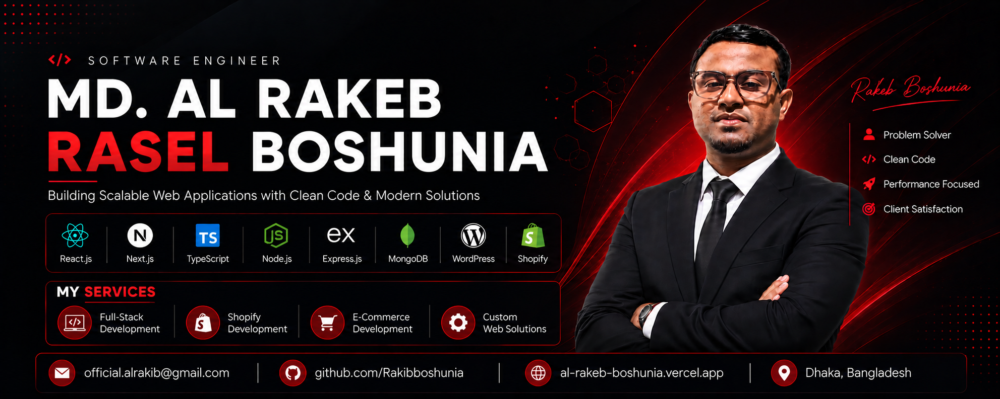

<!-- ===================================================== -->
<!--                     HERO SECTION                      -->
<!-- ===================================================== -->

  

<h1 align="center">Hi 👋 I'm MD. Al Rakeb Rasel Boshunia</h1>

<h3 align="center">
Software Engineer | Full Stack Developer | React.js | Next.js | TypeScript | Node.js | Express.js | MongoDB | WordPress & Shopify Expert
</h3>

  

---

### 👨‍💻 About Me

I'm a Software Developer passionate about building modern, scalable, and high-performance web applications. My primary expertise includes React.js, Next.js, TypeScript, JavaScript, Node.js, Express.js, and MongoDB. I enjoy developing clean, maintainable, and user-focused applications with an emphasis on reusable components, performance, and modern software architecture.

In addition to modern JavaScript development, I also specialize in WordPress and Shopify development, building custom business websites, eCommerce stores, landing pages, and CMS-based solutions tailored to business needs.

I have hands-on experience building SaaS platforms, ERP systems, AI-powered applications, eCommerce solutions, business websites, and custom web applications. I'm continuously expanding my backend expertise with PostgreSQL, Prisma, and MongoDB to deliver complete end-to-end software solutions.

I'm passionate about solving real-world problems through technology, writing clean and maintainable code, learning new technologies, and collaborating with teams to build reliable, production-ready software that creates real business value.

---

# 🛠 Tech Stack

### Frontend

  

### Backend

  

### Database & ORM

  

### CMS & eCommerce

  
  

### Tools

  

### AI Tools

  
  
  
  
  

  
  
  
  

---

# 🚀 Featured Projects

## Custom Web Applications

| Full Stack Development Project |
|--------------------------------|

| Soundtrack My Night |
| React.js • JavaScript • Node.js • Express.js • MongoDB |
 
| EduKai CV Subscription |
| React • Python • Django |
 
| MediAI Dashboard |
| React • Python • Django |
 
| BoiToi LMS |
| Next.js • React.js • TypeScript • Node.js • Express.js • MongoDB |

---

| Frontend Development Project |
|------------------------------|

| ERP System |
| Next.js • React • TypeScript • Node.js • Express.js • MongoDB |
 
| TaskFlow AI |
| Next.js • React • TypeScript • Tailwind CSS |
 
| MediCare Pro |
| Next.js • React • TypeScript • MongoDB |
 
| EduNest |
| React • Firebase • Tailwind CSS |
 
| Daily Basket |
| React • Tailwind CSS |
 
| Rory Music Playlist |
| React • JavaScript |
 
| Vango Live |
| Next.js • React |
 
| Decentralized E-Voting |
| Solidity • Ethereum • Hardhat |
 
| World Atlas |
| React • REST API |

| CMS Development Project |
|-------------------------|

| Italian Bracelets |
| WordPress • Elementor Pro • WooCommerce |
 
| Allswell Care Services |
| WordPress • Elementor Pro |
 
| Property Elevated |
| WordPress • Elementor Pro |
 
| Squeaky Clean Experts |
| WordPress • Elementor Pro |
 
| Cyber Security Services |
| WordPress • Elementor Pro |
 
| Shopify Store Development |
| Shopify • Liquid • HTML • CSS • JavaScript |

---

# 📊 GitHub Analytics

---

# 📈 Contribution Graph

---

# 🐍 Contribution Snake 
  

---

# 🤝 Let's Connect

